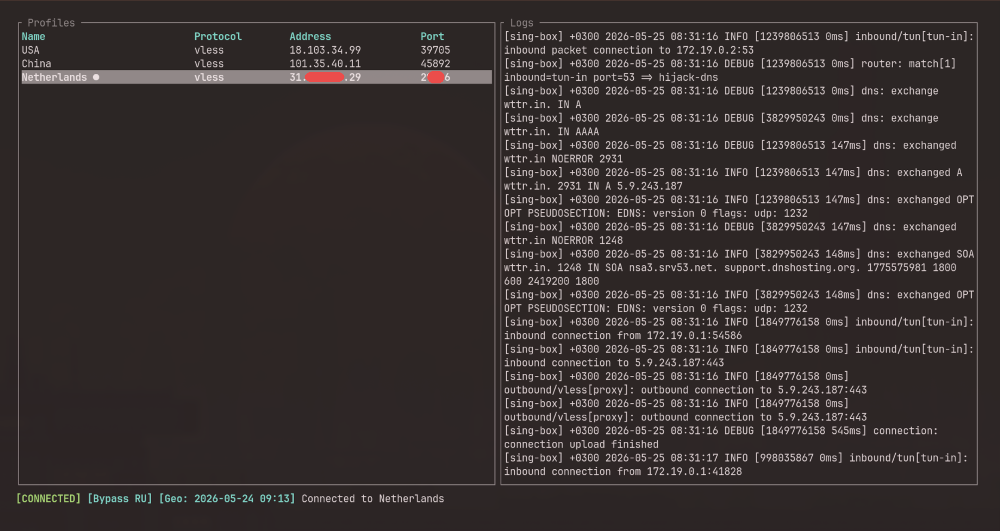

# kvn-tui

[](https://github.com/yarikov/kvn-tui/actions/workflows/ci.yml)
[](https://aur.archlinux.org/packages/kvn-tui-bin)
[](https://github.com/yarikov/kvn-tui/releases/latest)
[](https://www.rust-lang.org)
[](LICENSE)

> Terminal VPN client for Arch Linux + Wayland with vim navigation.

`kvn-tui` is a keyboard-driven TUI application for managing VPN connections. It provides a fast, minimal interface for configuring profiles, connecting via the [sing-box](https://sing-box.sagernet.org/) backend, and routing traffic — all without leaving the terminal.



---

## Features

- **Vim-style navigation** — `j`/`k` to move, `g`/`G` to jump, `?` for help
- **Profile management** — edit via `$EDITOR`, delete, and organize server profiles
- **One-click paste** — import `vless://` share links directly from the Wayland clipboard
- **Geo region selection** — choose Russia, China, Iran, or Global on first launch; only relevant routing modes and geo databases are shown/downloaded
- **Routing modes** — Global, Bypass RU, Only RU, Bypass CN, Only CN, Bypass IR, Only IR (powered by geoip/geosite rule-sets)
- **Geo database updates** — download and update rule-sets from within the app
- **External editor support** — open `profiles.json` in `$EDITOR` without leaving the TUI
- **Auto-connect** — automatically reconnect to the last used profile on startup
- **Suspend/resume awareness** — automatically detects system resume via D-Bus and reconnects
- **Live logs** — tail sing-box output in a split-pane view

---

## Supported Protocols

| Protocol | Status | Notes |
|----------|--------|-------|
| **VLESS** | ✅ Supported | REALITY / XTLS Vision, gRPC, WebSocket, HTTPUpgrade |

VLESS share links (`vless://`) can be pasted directly from the clipboard. The parser automatically extracts UUID, server address, port, flow, security settings, transport type, and REALITY parameters (public key, short ID, SNI, fingerprint).

> **Note:** Only VLESS is supported in the current release. Additional protocols may be added in future versions.

---

## Technology Stack

Under the hood, `kvn-tui` is built entirely in **Rust** and leverages the following ecosystem:

| Component | Library / Tool | Purpose |
|-----------|--------------|---------|
| TUI framework | [ratatui](https://ratatui.rs/) + [crossterm](https://github.com/crossterm-rs/crossterm) | Terminal UI rendering and input handling |
| VPN backend | [sing-box](https://sing-box.sagernet.org/) (external binary) | Actual VPN engine (TUN, routing, protocols) |
| Serialization | [serde](https://serde.rs/) + `serde_json` | Configuration and profile storage |
| HTTP client | [ureq](https://github.com/algesten/ureq) | Geo database downloads |
| D-Bus integration | [zbus](https://docs.rs/zbus/latest/zbus/) | Suspend/resume detection via `systemd-logind` |
| Logging | [tracing](https://github.com/tokio-rs/tracing) | Structured application logs |
| Error handling | [anyhow](https://github.com/dtolnay/anyhow) + [thiserror](https://github.com/dtolnay/thiserror) | Ergonomic error propagation |
| Utilities | `uuid`, `chrono`, `url`, `urlencoding`, `dirs` | IDs, timestamps, URI parsing, XDG directories |

### Architecture Highlights

- **Daemon + TUI client** — the application splits into a headless daemon (owns sing-box, config, and state) and a TUI client (renders UI and forwards input). They communicate over a Unix domain socket via NDJSON. Running `sudo kvn-tui` auto-starts the daemon in the background if it is not already running.
- **TEA (The Elm Architecture)** — the daemon's business logic is split into pure `Model` / `update` / `Effect` layers. `update.rs` is fully synchronous and side-effect-free, making it easy to unit-test.
- **sing-box runner** — dynamically generates valid sing-box 1.12+ JSON configurations from profile data, validates them with `sing-box check`, and spawns the process with automatic crash detection.
- **Background services** — event reader, ticker, suspend watcher, IPC server, and effect workers run in dedicated threads inside the daemon communicating through an `mpsc` channel. Log tailing and geo updates are driven by messages, not shared mutable state.
- **Atomic config writes** — `profiles.json` is written to a temporary file and renamed to prevent corruption.
- **State I/O** — connection status and active profile are persisted to `state.json` for waybar integration and crash recovery.

---

## Platform Support

> ⚠️ **Current version supports Arch Linux on Wayland only.**

The application relies on Wayland-specific clipboard integration (`wl-paste`) and D-Bus/systemd-logind for power events. X11 support is not available at this time.

---

## Installation (Arch Linux)

### Install from AUR (recommended)

`sing-box` installs automatically as a dependency.

```bash
yay -S kvn-tui-bin
```

### Omarchy Setup

If you use [Omarchy](https://omarchy.org/), run this after installation to enable Waybar integration:

```bash
kvn-tui --install-omarchy
```

This automatically:

- Installs the `omarchy-launch-kvn-tui` launcher script to `~/.local/bin/`
- Adds a `custom/kvn-tui` module to Waybar (shows connected/disconnected status, clicks open the TUI)
- Optionally adds the kvn-tui **daemon** to Hyprland autostart (`~/.config/hypr/autostart.conf`) — runs headlessly on login
- Optionally adds a Hyprland keybinding to open the TUI (default: `Super + Ctrl + K`)
- Configures the TUI window to open centered and floating
- Backs up your Waybar and Hyprland configs before modifying them
- Restarts Waybar to apply changes

> The installer is idempotent — running it again will skip already-applied changes.

After installation, the daemon starts automatically on login. Open the TUI on demand via the Waybar module, the keybinding, or by running `omarchy-launch-kvn-tui`.

### Build & Install from Source

#### Prerequisites

- **Rust** >= 1.87
- **sing-box** >= 1.12 (external VPN backend, must be available on `$PATH`)
- `base-devel`, `dbus`

Install the dependencies:

```bash
yay -S base-devel rust dbus sing-box
```

> `makepkg -si` will pull these automatically from the PKGBUILD `depends`/`makedepends`, but installing them beforehand avoids surprises.

#### Steps

1. Clone the repository:

```bash
git clone https://github.com/yarikov/kvn-tui.git
cd kvn-tui
```

2. Build and install using the local PKGBUILD:

```bash
cd pkg/arch
makepkg -si
```

This compiles the release binary with `--release --locked` and installs it to `/usr/bin/kvn-tui`.

3. Verify that sing-box is reachable:

```bash
sing-box version
```

> You must run `kvn-tui` as root so that sing-box can create the TUN interface. See [Quick Start](#quick-start) below.

### Manual Build (without package manager)

```bash
cargo build --release
sudo install -Dm755 target/release/kvn-tui /usr/local/bin/kvn-tui
```

---

## Quick Start

Launch the application:

```bash
sudo kvn-tui
```

> `kvn-tui` must be run as root so that sing-box can create and manage the TUN interface and system routes.

### Run without password

To avoid typing your password on every launch, create a sudoers drop-in file:

```bash
echo "$USER ALL=(ALL) NOPASSWD: /usr/bin/kvn-tui" | sudo tee /etc/sudoers.d/kvn-tui
sudo chmod 440 /etc/sudoers.d/kvn-tui
```

Then launch with:

```bash
sudo kvn-tui
```

> Adjust the path `/usr/bin/kvn-tui` if you installed to `/usr/local/bin/kvn-tui` or another location. Use `which kvn-tui` to verify.

### Default Key Bindings

| Key | Action |
|-----|--------|
| `j` / `↓` | Move down |
| `k` / `↑` | Move up |
| `g` | Go to first profile |
| `G` | Go to last profile |
| `Enter` | Connect to selected profile |
| `p` | Paste `vless://` link from clipboard |
| `d` | Delete selected profile |
| `m` | Change routing mode |
| `o` | Select geo region |
| `u` | Update geoip/geosite databases |
| `e` | Open `profiles.json` in `$EDITOR` |
| `a` | Toggle auto-connect |
| `r` | Reconnect |
| `s` | Stop / disconnect |
| `q` / `Esc` | Detach TUI — daemon and sing-box keep running. If an overlay is open, closes the overlay first |
| `Ctrl+C` | Quit — stop daemon and sing-box, then exit |
| `?` | Show help |

---

## Configuration

Configuration is stored in:

```
~/.config/kvn-tui/profiles.json
```

The file contains your profile list and application settings (default profile, TUN interface name, DNS strategy, routing mode, auto-connect, geo region). You can edit it manually with the `e` keybinding or any text editor.

When `auto_connect` is enabled, the application stores `last_connected_profile` and automatically connects to that profile on the next startup.

`settings.geo_region` controls which country rule-sets are downloaded and which routing modes are available. Valid values: `ru`, `cn`, `ir`, or `global`.
- `ru` — download RU geoip/geosite, enable Global / Bypass RU / Only RU
- `cn` — download CN geoip/geosite, enable Global / Bypass CN / Only CN
- `ir` — download IR geoip/geosite, enable Global / Bypass IR / Only IR
- `global` — skip geo downloads, enable Global only

On the very first launch (or after upgrading from an older version without `geo_region`), a modal overlay forces you to pick a region before the main UI becomes usable.

Geo rule-set databases are cached in:

```
~/.config/kvn-tui/geo/
```

Logs (both sing-box output and app status messages) are written to:

```
~/.config/kvn-tui/logs/sing-box.log
```

---

## Roadmap to v1.0.0

- **Kill switch support** — block all outbound traffic if the VPN connection drops unexpectedly
- **All sing-box protocols** — extend beyond VLESS to support Shadowsocks, Trojan, VMess, Hysteria 2, and any other protocol sing-box supports
- **DNS configuration** — custom DNS servers, routing rules, and strategy settings (e.g., DoH, DoT, fake-ip)
- **Traffic statistics** — live bandwidth and connection stats in the TUI
- **Import/Export profiles** — bulk import from subscription links and export profiles to shareable links

---

## Author

Created and maintained by [Dmitry Yarikov](https://github.com/yarikov) — <dmitry@yarikov.com>.

## License

MIT
