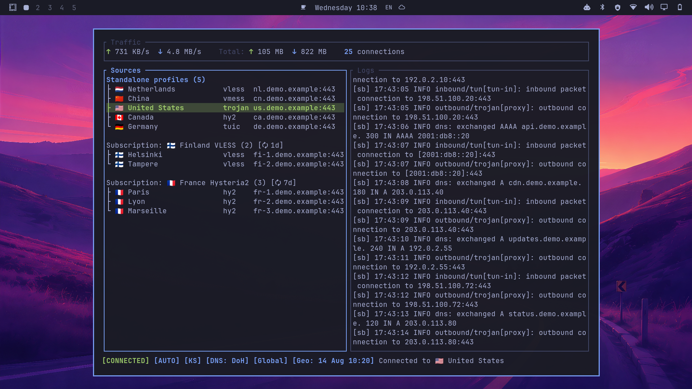

# kvn-tui

[](https://github.com/yarikov/kvn-tui/actions/workflows/ci.yml)
[](https://aur.archlinux.org/packages/kvn-tui-bin)
[](https://github.com/yarikov/kvn-tui/releases/latest)
[](https://www.rust-lang.org)
[](LICENSE)

> Terminal VPN client for Arch Linux with vim navigation.

`kvn-tui` is a keyboard-driven TUI application for managing VPN connections. It provides a fast, minimal interface for configuring profiles, connecting via the [sing-box](https://sing-box.sagernet.org/) backend, and routing traffic — all without leaving the terminal.



---

## Contents

- [Features](#features)
- [Supported Protocols](#supported-protocols)
- [First Connection](#first-connection)
- [Installation (Arch Linux)](#installation-arch-linux)
  - [AUR](#aur-recommended)
  - [Polkit setup](#polkit-setup-recommended)
  - [Kill switch setup](#kill-switch-setup-optional)
  - [Omarchy](#omarchy-optional)
  - [Build from source](#build-from-source)
- [Diagnostics](#diagnostics)
- [Default Key Bindings](#default-key-bindings)
- [Configuration](#configuration)
- [Technology Stack](#technology-stack)
- [Architecture Highlights](#architecture-highlights)
- [Upgrading to v0.22.0 on Omarchy](#upgrading-to-v0220-on-omarchy)
- [Upgrading to v0.20.0](#upgrading-to-v0200)
- [Author](#author)
- [License](#license)

---

## Features

- **Vim-style navigation** — `j`/`k` to move, `gg`/`G` to jump, `?` for help
- **Profiles & subscriptions** — import, export, edit, and automatically update VPN profiles
- **Geo & service routing** — choose country-based routing modes and ready-made overrides for selected services
- **DNS controls** — built-in DoH, DoT, system resolver, strategy, and fake-IP settings
- **Kill switch** — block outbound traffic if the VPN connection drops
- **Automatic recovery** — auto-connect on startup and reconnect after suspend
- **Live insights** — traffic rates, totals, active connections, and combined logs
- **Themes** — choose from 22 bundled color palettes directly in the TUI

---

## Supported Protocols

`kvn-tui` supports 11 sing-box outbound protocols. Profiles can be imported
from the listed share-link schemes via the clipboard or a subscription and
exported with `y`.

| Protocol | Share-link scheme(s) | Key support |
|----------|----------------------|-------------|
| **VLESS** | `vless://` | REALITY, XTLS Vision, TLS; gRPC, WebSocket, HTTP |
| **VMess** | `vmess://` | Base64 JSON and URI formats; TLS and shared transports |
| **Trojan** | `trojan://` | TLS; gRPC, WebSocket, HTTP |
| **Shadowsocks** | `ss://` | AEAD and AEAD-2022 ciphers; SIP002 and legacy Base64 |
| **Hysteria 2** | `hysteria2://`, `hy2://` | QUIC and Salamander obfuscation |
| **TUIC** | `tuic://` | TUIC v5, congestion control, and UDP relay modes |
| **ShadowTLS** | `shadowtls://` | Versions 1–3 with an inner Shadowsocks connection |
| **AnyTLS** | `anytls://` | TLS-based multiplexing |
| **SOCKS** | `socks://`, `socks5://` | SOCKS4, SOCKS4a, SOCKS5, and optional authentication |
| **HTTP proxy** | `http://`, `https://` | HTTP CONNECT with optional TLS and authentication |
| **SSH** | `ssh://` | Password and private-key authentication |

---

## First Connection

After installation, launch kvn-tui:

```bash
kvn-tui
```

Choose a regional routing preset on first launch, then:

1. Copy a share link (`vless://`, `ss://`, `hysteria2://`, …) or a subscription URL to the clipboard.
2. Press `p` to import it.
3. Select a profile with `j` / `k` and press `Enter` to connect.

Clipboard import requires `wl-clipboard` on Wayland or `xclip` / `xsel` on X11.
Press `?` at any time to see the full key map.

---

## Installation (Arch Linux)

Optional setup commands modify system or desktop configuration. See
[system integration details](docs/system-integration.md) for installed files,
permissions, and removal instructions.

### AUR (recommended)

```bash
yay -S kvn-tui-bin
systemctl --user enable --now kvn-tui.service
```

`sing-box` is installed automatically. The user service keeps the daemon
available after login.

### Polkit setup (recommended)

Install the polkit rule to avoid repeated authentication prompts when sing-box
changes DNS settings or routes:

```bash
sudo kvn-tui setup --polkit
```

If setup adds you to the `network` group, run `newgrp network` or log out and
back in.

### Kill switch setup (optional)

The kill switch requires `nftables` and blocks outbound traffic when the VPN is
not active:

```bash
sudo pacman -S nftables
sudo kvn-tui setup --killswitch
```

If setup adds you to the `network` group, run `newgrp network` or log out and
back in.

Toggle it with `K`; the status bar shows `[KS]` while it is enabled. Polkit and
the kill switch can also be installed together:

```bash
sudo kvn-tui setup --polkit --killswitch
```

### Omarchy (optional)

Enable Shell/Waybar, launcher, Hyprland, and floating-window integration with:

```bash
kvn-tui setup --omarchy
```

The idempotent installer detects Omarchy 3 or 4 and creates backups before
editing user configuration. Remove those backups after verification with:

```bash
kvn-tui clean --omarchy
```

This removes only backups, not the active integration.

### Build from source

Requires Rust 1.88+, sing-box 1.12+, `base-devel`, `dbus`, and a clipboard tool
(`wl-clipboard` on Wayland or `xclip` / `xsel` on X11).

```bash
yay -S base-devel rust dbus sing-box wl-clipboard
git clone https://github.com/yarikov/kvn-tui.git
cd kvn-tui
```

For a packaged installation with the binary in `/usr/bin` and the systemd user
service included:

```bash
cd pkg/arch
makepkg -si
```

Alternatively, install only the binary from the repository root:

```bash
cargo build --release --locked
sudo install -Dm755 target/release/kvn-tui /usr/local/bin/kvn-tui
sudo setcap cap_net_admin,cap_net_raw+ep "$(command -v sing-box)"
```

The capabilities allow sing-box to use TUN without running kvn-tui as root. The
bundled service expects `/usr/bin/kvn-tui`; with a manual installation, use the
automatic detached daemon or change its `ExecStart` to
`/usr/local/bin/kvn-tui --daemon`.

## Diagnostics

```bash
kvn-tui doctor
```

Runs a read-only check of sing-box, configuration, the daemon, clipboard, and
optional integrations, with remediation hints for detected problems. Run it as
your regular user; it exits with an error only when a required dependency is
unusable.

---

## Default Key Bindings

**Navigation**

| Key | Action |
|-----|--------|
| `h` / `l` | Focus the Sources / Logs panel |
| `j` / `↓` | Move down one source or complete log record |
| `k` / `↑` | Move up one source or complete log record |
| `gg` | Go to the first item or the top of the complete log buffer |
| `G` | Go to the last item or the bottom of the complete log buffer |

The focused panel is preserved while the daemon remains active. Selectable
overlays use the same `j` / `k` / `gg` / `G` navigation. In Logs, the first
`j` selects the top visible record and the first `k` selects the bottom visible
record; the record focus clears after 15 seconds of inactivity.

**Logs**

| Key | Action |
|-----|--------|
| `y` | Copy the focused log record, or every record in the visual selection |
| `Shift+V` | Start a record-wise visual selection |
| `j` / `k` | Extend the visual selection by one complete log record |
| `gg` / `G` | Extend the visual selection to the start / end of the complete log buffer |
| `Esc` | Cancel the visual selection |

**Profiles & subscriptions**

| Key | Action |
|-----|--------|
| `Enter` | Connect to selected profile |
| `p` | Paste share link or subscription URL from clipboard |
| `y` | Yank the selected profile as a share link (or subscription source URL) to the clipboard |
| `d` | Delete selected source |
| `u` | Update selected subscription or geoip/geosite databases |
| `i` | Cycle subscription auto-update interval |
| `I` | Cycle geoip/geosite auto-update interval |
| `e` | Open `profiles.json` in `$EDITOR` |

**Connection & routing**

| Key | Action |
|-----|--------|
| `m` | Change routing mode |
| `o` | Select geo region |
| `a` | Toggle auto-connect |
| `K` | Toggle kill switch |
| `D` | DNS settings (presets, strategy, fake-IP) |
| `S` | Service routing (Steam / Telegram → Proxy / Direct) |
| `C` | Theme picker (live preview, Enter to persist) |
| `t` | Test latency of selected profile |
| `T` | Test latency of all profiles (up to 4 in parallel) |
| `r` | Reconnect |
| `s` | Stop / disconnect |

**Application**

| Key | Action |
|-----|--------|
| `q` / `Esc` | Close the active overlay; otherwise exit only the TUI — the daemon and VPN keep running (`Esc` cancels an active log selection first) |
| `Ctrl+C` | Stop the daemon, disconnect the VPN, and exit completely |
| `?` | Show help |

On terminals supporting the Kitty keyboard protocol, letter shortcuts follow
their physical US key positions regardless of the active keyboard layout.

---

## Configuration

Configuration is stored in `~/.config/kvn-tui/profiles.json`. Press `e` to edit
it in `$EDITOR`; invalid configuration is rejected when reloaded.

See the [configuration guide](docs/configuration.md) for the JSON structure,
advanced DNS and routing, validation, migrations, and runtime file locations.

---

## Technology Stack

`kvn-tui` is built with Rust 2024 and requires Rust 1.88 or newer.

| Component | Library / Tool | Purpose |
|-----------|--------------|---------|
| Terminal UI | [ratatui](https://ratatui.rs/) + [crossterm](https://github.com/crossterm-rs/crossterm) | Rendering, keyboard input, and terminal lifecycle |
| VPN backend | [sing-box](https://sing-box.sagernet.org/) 1.12+ | TUN, protocols, DNS, and traffic routing |
| Data formats | [serde](https://serde.rs/), `serde_json`, `toml` | Configuration, IPC messages, and bundled palettes |
| Networking | [ureq](https://github.com/algesten/ureq) with rustls | Subscriptions, rule-sets, and Clash API statistics |
| Linux integration | [zbus](https://docs.rs/zbus/latest/zbus/), `notify`, `signal-hook` | Suspend/resume, theme watching, and Unix signals |
| CLI | [clap](https://docs.rs/clap/) | Commands, setup options, and diagnostics |
| Observability | [tracing](https://github.com/tokio-rs/tracing) | Filtered application and daemon logs |
| Core utilities | `anyhow`, `uuid`, `chrono`, `url`, `base64`, `dirs` | Errors, IDs, timestamps, share links, and XDG paths |

### Architecture Highlights

- **Persistent daemon** — the daemon owns canonical state, sing-box, and background services; TUI clients attach over NDJSON on a Unix socket without interrupting the VPN.
- **TEA-style core** — `Model`, `Msg`, `update`, and declarative `Effect` values separate state transitions from runtime I/O and keep business logic testable.
- **Safe sing-box lifecycle** — 1.12+ configuration is generated, validated with `sing-box check`, and only then started with immediate-failure detection.
- **Headless background work** — reconnect after suspend, subscription and rule-set updates, traffic statistics, logs, and persisted state continue without an attached TUI.

---

## Upgrading to v0.22.0 on Omarchy

Version 0.22.0 adds native Omarchy 4 Shell and Lua integration, updates active-theme detection, and retains the Omarchy 3 Waybar flow. Omarchy users upgrading from an earlier kvn-tui release should follow the [v0.22.0 migration guide](docs/migrations/v0.22.0.md).

---

## Upgrading to v0.20.0

Version 0.20.0 moved daemon startup from Hyprland autostart to a systemd user service. If you are upgrading from v0.19.1 or earlier, follow the [v0.20.0 migration guide](docs/migrations/v0.20.0.md).

---

## Author

Created and maintained by [Dmitry Yarikov](https://github.com/yarikov) — <dmitry@yarikov.com>.

## Contributing

Contributions are welcome. Before opening a pull request, read
[CONTRIBUTING.md](CONTRIBUTING.md) for branch naming, Conventional Commit and
pull request title requirements, testing, and coverage expectations. Pull
request titles are used in generated release notes.

## License

MIT
